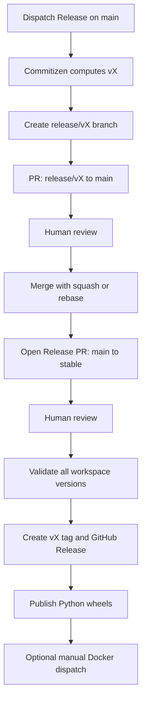

# Release Workflow Guide

This guide explains how maintainers use the release pipeline to select versions,
review release changes, create tags and GitHub Releases, and publish Python
wheels. Docker publishing remains a separate manual operation.

## Scope

| Workflow | Purpose | Trigger |
| --- | --- | --- |
| `release.yml` | Bump workspace versions, open release PRs, tag `stable`, create GitHub Releases, and open stable-patch back-merge PRs | Manual dispatch and pushes to `main`/`stable` |
| `pypi-publish.yml` | Build and publish wheels for `motrix-env-core`, `motrix-deploy`, and `motrix-rl` | GitHub Release publication or manual dispatch |
| `docker-build.yml` | Build and push the Docker image | Manual dispatch from `stable` |

**Stable branch patch release** is the preferred name for a patch cut from
`stable`. Its branch prefix remains `hotfix/*`; the prefix is a Git convention,
not a separate version class.

## One-time setup

1. Create the protected `stable` branch from a reviewed `main` commit.
2. Create a GitHub App for release automation and install it only on
   `Motphys/MotrixLab`. Grant the installation:
   - **Contents: read and write**
   - **Pull requests: read and write**
3. Store the App client ID as the `RELEASE_APP_CLIENT_ID` repository variable
   and its private key as the `RELEASE_APP_PRIVATE_KEY` secret.
4. Register PyPI Trusted Publishers for all three publishable projects on both
   pypi.org and test.pypi.org:
   - `motrix-env-core`
   - `motrix-deploy`
   - `motrix-rl`

   Use repository `Motphys/MotrixLab` and workflow `pypi-publish.yml`.
5. For Docker publishing, configure `DOCKER_USERNAME` and `DOCKER_PASSWORD`.

The workflows exchange the App credentials for a short-lived installation
token. Besides avoiding a long-lived personal access token, this is required
because resources created with a job's `GITHUB_TOKEN` do not trigger downstream
workflows. The App token makes generated PRs run normal required checks and
makes tag/GitHub Release creation trigger package publishing.

## Inputs and version rules

Run `release.yml` on `main` for a normal release or on `hotfix/*` for a stable
branch patch release.

| Input | Meaning |
| --- | --- |
| `mode` | `auto`, `patch`, `minor`, `major`, `beta`, or `stable`; defaults to `auto` |
| `version` | Exact PEP 440 version; when non-empty, it overrides `mode` |
| `open_release_pr` | Manual fallback that opens the current `main → stable` release PR without creating a version bump |

Version selection priority is:

```text
explicit version > mode > Conventional Commits
```

### Normal releases

With `mode=auto`, Commitizen examines commits after the most recent `v*` tag:

| Commit type | Bump |
| --- | --- |
| `fix`, `refactor`, `perf` | PATCH |
| `feat` | MINOR |
| Breaking change | MINOR while the project is `0.x` |
| `docs`, `chore`, `test`, `ci`, `build`, `style` | No bump |

`--major-version-zero` is added dynamically only while the current major
version is zero. It keeps automatic breaking changes below `1.0.0` during
initial development and is omitted automatically once the project reaches
`1.0.0`.

Manual modes have the same meanings as before:

| Mode | Result |
| --- | --- |
| `patch` | `X.Y.Z → X.Y.Z+1` |
| `minor` | `X.Y.Z → X.Y+1.0` |
| `major` | `X.Y.Z → X+1.0.0` |
| `beta` | Increment the beta number, such as `0.4.0b0 → 0.4.0b1` |
| `stable` | Remove a pending pre-release suffix, such as `0.4.0b0 → 0.4.0` |

Pre-release versions may be published to formal PyPI. They are still marked as
GitHub pre-releases when their version contains a PEP 440 beta segment.

Every explicit normal-release target must:

- parse as a PEP 440 version,
- be strictly newer than the current version,
- contain no development or local version segment.

Pre-release versions such as `0.5.0b0` are valid explicit targets.

### Stable branch patch releases

A `hotfix/*` branch must have `origin/stable` as its merge base and must be
current with the stable tip. If `stable` advances, merge `origin/stable` into
the patch branch or recreate the branch before dispatching the workflow.

Stable branch patch releases are hard-limited to PATCH increments:

- without `version`, only `mode=auto` and `mode=patch` are accepted, and both
  resolve as PATCH;
- with `version`, the target must be the exact next **final** patch version,
  for example `0.4.0 → 0.4.1`;
- beta, dev, post-release, local, minor, and major targets are rejected.

If a patch branch already contains a release bump, that bump must be its latest
commit. Re-running preparation then validates the existing exact patch version
and is otherwise a no-op.

### Synchronized files and guards

Before opening a reviewed PR or pushing a patch bump, the workflow:

1. validates the selected version against the current version;
2. verifies that `vX.Y.Z` does not already exist;
3. runs Commitizen once as a dry run and once to modify files;
4. updates the root and every workspace member `pyproject.toml`;
5. updates internal `motrix-*` dependencies to the same exact pin;
6. runs `uv lock`;
7. verifies every workspace package has the selected version;
8. runs `tests/test_workspace_versions.py`.

The dry-run result must equal the version written to the files. The stable tag
job repeats the all-workspace version checks and the version-contract test
before it creates a Git tag or GitHub Release.

## Normal release



### Steps

1. Confirm that checks on `main` are green.
2. Open **Actions → Release → Run workflow**, select `main`, and choose a mode
   or exact version:

   ```bash
   gh workflow run release.yml --ref main --field mode=auto
   ```

3. Wait for **Prepare version bump pull request** to finish.
4. Review the generated `release/vX.Y.Z → main` PR.
5. Merge that PR with **squash or rebase** and preserve a head-commit subject
   beginning with:

   ```text
   chore(release): bump version to vX.Y.Z
   ```

   Do not use an ordinary merge commit: the push trigger recognizes the release
   bump by the new `main` head subject.

6. Review and merge the generated **Release vX.Y.Z** PR from `main` to
   `stable`.
7. The stable push validates all workspace versions and release contracts,
   creates the tag and GitHub Release, and starts wheel publishing.
8. Optionally run **Build and Push Docker Image** from `stable`.

If the automatic `main → stable` PR was not created—for example, because the
version-bump PR was merged with an unexpected strategy—run `release.yml` on
`main` with `open_release_pr=true`:

```bash
gh workflow run release.yml \
  --ref main \
  --field open_release_pr=true
```

## Stable branch patch release

```mermaid
flowchart TD
    A[stable] --> B[Create current hotfix/* branch]
    B --> C[Commit fixes]
    C --> D[Dispatch Release as patch]
    D --> E[Validate exact next patch version]
    E --> F[Push chore(release) to hotfix/*]
    F --> G[PR: hotfix/* to stable]
    G --> H[Human review]
    H --> I[Create vX.Y.Z+1 tag and GitHub Release]
    I --> J[Publish Python wheels]
    I --> K[Open PR: stable to main]
    K --> L[Human back-merge review]
```

### Steps

1. Create the patch branch from the current upstream `stable` tip:

   ```bash
   git fetch origin
   git switch -c hotfix/fix-description origin/stable
   ```

2. Commit the fix with a conventional commit, preferably:

   ```text
   fix: describe the corrected behavior
   ```

3. Push the branch:

   ```bash
   git push -u origin HEAD
   ```

4. Run the release workflow on that branch:

   ```bash
   branch="$(git branch --show-current)"
   gh workflow run release.yml --ref "$branch" --field mode=patch
   ```

5. The workflow pushes `chore(release): bump version to vX.Y.Z+1` to the patch
   branch and opens the `hotfix/* → stable` PR.
6. Review and merge that PR into `stable`.
7. Wait for tag creation, GitHub Release publication, and Python publishing.
8. Review and merge the automatically created `stable → main` back-merge PR.

Do not replace the final back-merge with a direct `hotfix/* → main` PR. The
release tag points at the reviewed merge result on `stable`; merging
`stable → main` carries that exact released state and version history back to
development.

The back-merge PR is opened after the tag job succeeds. Package publishing is
event-driven and runs asynchronously, so verify that all publishing jobs and the
published artifacts are healthy before merging it.

## Python wheel publishing

Publication is automatic when a GitHub Release is published. The build job
verifies that:

- the release commit is reachable from `origin/stable`;
- `v` plus the workspace version exists and points exactly at the selected
  commit;
- the release tag matches the workspace version;
- every workspace package has the same version.

Only wheels are built. The three public distributions are published in
dependency order:

```text
motrix-env-core → motrix-deploy → motrix-rl
```

Publishing uses `skip-existing: true`: if one package job succeeds and a later
job fails, re-running the failed path skips immutable distributions that are
already present and publishes only the missing package. It never replaces a
previously uploaded version.

### TestPyPI validation

Before a production release, manually run `pypi-publish.yml` on a reviewed
commit and select `index=testpypi`:

```bash
gh workflow run pypi-publish.yml \
  --ref main \
  --field index=testpypi
```

TestPyPI validation is intentionally more permissive so pre-release commits can
be exercised before a stable tag exists.

The `index=pypi` manual option is retained for recovery, but it performs the
same production checks as a Release event: the selected commit must be reachable
from `stable`, and the matching immutable `v*` tag must point exactly at that
commit. Normal production publishing should still occur through the reviewed
GitHub Release event.

## Automation and human gates

| Stage | Automation |
| --- | --- |
| Version calculation and validation | Automatic after manual dispatch |
| Normal version bump PR | Automatic |
| Merge version bump into `main` | Human review |
| Open `main → stable` release PR | Automatic, with manual fallback |
| Merge release into `stable` | Human review |
| Workspace release checks | Automatic before tagging |
| Tag and GitHub Release | Automatic |
| Python wheel publishing | Automatic |
| Stable patch `stable → main` PR | Automatic |
| Stable patch back-merge review | Human |
| Docker image publishing | Manual dispatch |

## Failure recovery

| Symptom | Action |
| --- | --- |
| `vX.Y.Z` already exists | Select a new version; Git tags and PyPI uploads are immutable |
| `release/vX.Y.Z` already exists | Inspect its open PR first. Close and delete it only if the version was never tagged or published |
| Commitizen finds no bumpable commits | Use an explicit mode or exact version |
| Explicit version is rejected | Use a strictly newer PEP 440 version without dev or local segments |
| Stable patch version is rejected | Use the exact next final patch version and update the branch from `stable` |
| Workspace versions or internal pins diverge | Fix the `pyproject.toml` files and regenerate `uv.lock` |
| Release App token cannot be created | Check `RELEASE_APP_CLIENT_ID`, `RELEASE_APP_PRIVATE_KEY`, installation scope, and permissions |
| Tag exists at the same stable commit but the GitHub Release is missing | Re-run the stable release job; tag creation is idempotent |
| Tag exists at a different commit | Add a new version bump and merge it to `stable`; never move the tag |
| Only part of PyPI publication succeeded | Re-run the failed publishing jobs; unchanged existing distributions are skipped |
| `main` push did not open a release PR | Use the `open_release_pr=true` manual fallback and enforce squash/rebase for future release PRs |
| Back-merge PR was not created | Confirm the stable job completed and the stable head is associated with a merged `hotfix/* → stable` PR |

## Operational checklist

Before merging anything into `stable`:

- [ ] Required PR checks, tests, and CodeQL are green.
- [ ] The release PR contains the intended version bump and lockfile changes.
- [ ] Internal `motrix-*` dependencies are exact pins to the workspace version.
- [ ] TestPyPI validation has succeeded for a nontrivial release.
- [ ] PyPI Trusted Publishers are configured.
- [ ] The release GitHub App is installed with Contents and Pull requests
      write permissions.

After publication:

- [ ] Verify the GitHub Release and immutable tag.
- [ ] Verify all three Python publishing jobs succeeded.
- [ ] Install or inspect the published wheels.
- [ ] Run Docker publishing manually if this release needs a new image.
- [ ] For a stable branch patch release, review and merge the automatic
      `stable → main` back-merge PR.
