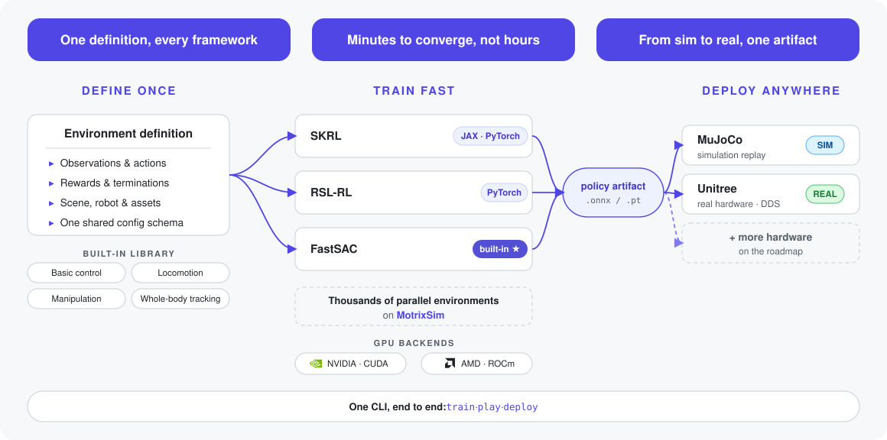

**Language**: [English](README.md) | [简体中文](README.zh-CN.md)

<div align="center">

# MotrixLab

[](LICENSE)

[](https://github.com/Motphys/MotrixLab/releases)
[](https://motrixlab.readthedocs.io)

**Train robot policies in simulation, then deploy them to real hardware.**


_Microduck locomotion policies trained with MotrixLab, rendered in MotrixRender — [watch the HD video](https://github.com/user-attachments/assets/4bcf3122-f135-44cb-a966-d2d8e84479da)._

**📖 Documentation**: [简体中文](https://motrixlab.readthedocs.io/zh-cn/stable/) | [English](https://motrixlab.readthedocs.io/en/stable/)

</div>

## Contents

- [What is MotrixLab?](#what-is-motrixlab)
- [Key Features](#key-features)
- [Quick Start](#-quick-start)
- [Task Environments](#-task-environments)
- [Built-in Robot Models](#-built-in-robot-models)
- [What's Inside](#-whats-inside)
- [Contributing](#-contributing)
- [Contact](#-contact)

## What is MotrixLab?

**MotrixLab** is an open-source reinforcement learning framework for robot training, built on the high-performance [MotrixSim](https://github.com/Motphys/motrixsim-docs) physics engine. Define an environment once, train it with thousands of parallel environment instances using SKRL, RSL-RL, or the built-in FastSAC, and deploy the resulting policy to MuJoCo or Unitree hardware — all through a single command-line interface.

<div align="center">
  <picture>
    <source media="(prefers-color-scheme: dark)" srcset="docs/source/_static/images/architecture-dark.svg">
    
  </picture>
</div>

## Key Features

- **Unified Interface**: Provides a concise and unified reinforcement learning training and evaluation interface
- **Multi-framework Support**: Supports SKRL (JAX/PyTorch), RSLRL (PyTorch), and the built-in FastSAC implementation
- **Rich Environments**: Includes various robot simulation environments such as basic control, locomotion, and manipulation tasks
- **Sim-to-Real Deployment**: The same policy code deploys via the deploy CLI — Sim2Sim to MuJoCo, Sim2Real to real hardware
- **High-precision, High-performance Simulation**: Built on [MotrixSim](https://motrixsim.readthedocs.io/), a high-precision, high-performance physics engine
- **Visual Training**: Supports real-time rendering and training process visualization

## 🚀 Quick Start

### Prerequisites

| Requirement | Notes |
| --- | --- |
| Python **3.10.x** | The workspace pins `==3.10.*` |
| [uv](https://docs.astral.sh/uv/) | Python project and dependency manager — [installation guide](https://docs.astral.sh/uv/getting-started/installation/) |
| [Git LFS](https://git-lfs.com) | Robot meshes, motion data, and videos are tracked by LFS |
| OS | Linux x86_64 or Windows x86_64; the JAX training backend is Linux-only |

### 1. Clone the repository

```bash
git clone https://github.com/Motphys/MotrixLab
cd MotrixLab
git lfs pull
```

### 2. Install dependencies

```bash
uv sync --all-packages
```

This installs all workspace packages together with **PyTorch**, the default training backend used by the built-in FastSAC. Third-party frameworks such as SKRL and RSLRL are optional extras.

### 3. Train your first policy

```bash
uv run scripts/train.py task=microduck-walk-flat/motrix.fastsac play=true
```

While training, the built-in dashboard shows live run progress, episode statistics, throughput, rewards, and system health:

<p align="center">
  
</p>

Training runs thousands of parallel environment instances; when it finishes, the trained policy is loaded and played in the viewer automatically. Checkpoints and TensorBoard logs are saved under `runs/microduck-walk-flat/`; watch the curves with:

```bash
uv run tensorboard --logdir runs/microduck-walk-flat
```

Training finishes in minutes: mean return and episode length typically converge after about 4,000 iterations:

<p align="center">
  
</p>

### 4. Replay the trained policy

Replay the latest trained policy without retraining (for example, after stopping training early with Ctrl+C):

```bash
uv run scripts/play.py env=microduck-walk-flat
```

A trained microduck policy replayed in the viewer:

https://github.com/user-attachments/assets/4bcf3122-f135-44cb-a966-d2d8e84479da

## 🌍 Task Environments

MotrixLab ships 50+ built-in simulation environments spanning basic control, quadruped and humanoid locomotion, whole-body motion tracking, and manipulation. The main categories:

| Preview | Category | Example environments |
| --- | --- | --- |
|  | Quadruped velocity tracking | `go2-walk-flat` · `go2-walk-rough` · `go1-walk-rough` · `anymalc-walk-flat` |
|  | Humanoid velocity tracking | `g1-walk-flat` · `k1-walk-rough` · `dex-evt-walk-flat` · `microduck-walk-flat` |
|  | Whole-body tracking (WBT) | `g1-wbt-dance` · `k1-wbt-freekick` · `g1-29dof-wbt-largebox` |

```bash
uv run scripts/view.py env=go2-walk-rough
```

See the [full environment gallery](https://motrixlab.readthedocs.io/en/latest/user_guide/envs/index.html) for all registered environments and their supported training algorithms.

## 🤖 Built-in Robot Models

Seven reusable robot models are registered out of the box and can be combined into any scene or task:

| Screenshot | Registry name | Type | DoF |
| --- | --- | --- | --- |
|  | `anymal_c` | Quadruped | 12 |
|  | `dex-evt` | Humanoid | 23 |
|  | `g1-29dof` | Humanoid | 29 |
|  | `go1` | Quadruped | 12 |
|  | `go2` | Quadruped | 12 |
|  | `k1` | Humanoid | 22 |
|  | `microduck` | Humanoid | 14 |

```bash
uv run scripts/view.py robot=go2
```

See [Supported Robots](https://motrixlab.readthedocs.io/en/latest/user_guide/robots.html) for configuration details and how to add your own model.

## 🏗️ What's Inside

MotrixLab is a [uv](https://docs.astral.sh/uv/) workspace of nine packages:

| Package | PyPI name | Description |
| --- | --- | --- |
| **motrix_deploy** | `motrix-deploy` | Framework-independent artifact, backend, policy, control-loop, registry, and CLI |
| **motrix_deploy_mujoco** | `motrix-deploy-mujoco` | MuJoCo deployment backend plugin |
| **motrix_deploy_unitree** | `motrix-deploy-unitree` | Unitree SDK2 DDS hardware backend plugin |
| **motrix_deploy_tasks** | `motrix-deploy-tasks` | Concrete versioned deployment tasks and executable bootstrap |
| **motrix_env_core** | `motrix-env-core` | Environment base classes, configuration, registry, scene construction, NumPy runtime, and rendering. It contains no built-in tasks or robot assets |
| **motrix_env_motrixsim** | `motrix-env-motrixsim` | Live MotrixSim backend, renderer, and torch frontend |
| **motrix_env_mujoco** | `motrix-env-mujoco` | Compile-only MuJoCo scene backend |
| **motrix_envs** | `motrix-envs` | Built-in environments, models, data, and environment-to-deployment-profile compilers |
| **motrix_rl** | `motrix-rl` | RL-framework integration built against `motrix-env-core`, with SKRL, RSLRL, and FastSAC support |

## 🤝 Contributing

Contributions are welcome! See [CONTRIBUTING.md](CONTRIBUTING.md) for the development environment setup, branch and commit conventions, and the configured checks (`prek`, `ruff`, `dprint`, `mypy`).

## 📬 Contact

Have questions or suggestions? Feel free to contact us through:

- GitHub Issues: [Submit Issues](https://github.com/Motphys/MotrixLab/issues)
- Discussions: [Join Discussion](https://github.com/Motphys/MotrixLab/discussions)

## Project policies

- [Contributing](CONTRIBUTING.md)
- [Security policy](SECURITY.md)
- [Code of Conduct](CODE_OF_CONDUCT.md)
- [Support](SUPPORT.md)
- [Third-party notices](THIRD_PARTY_NOTICES.md)
- [Changelog](CHANGELOG.md)
- [Citation metadata](CITATION.cff)
- [License](LICENSE)
